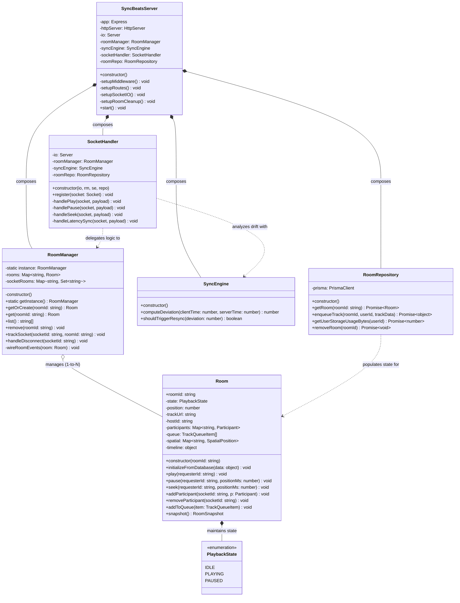
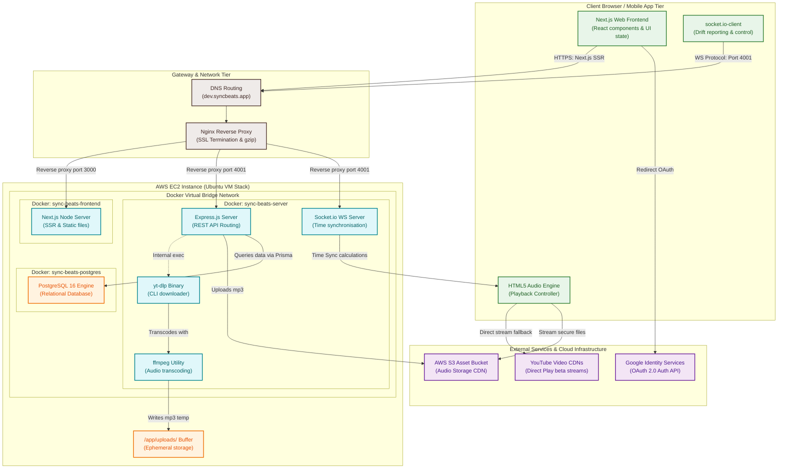

# SyncBeats System Design & Architecture Diagrams

This document contains a comprehensive suite of highly interactive system design, flow, data, and deployment diagrams for SyncBeats. It details how the Next.js frontend, Express/Socket.io backend, PostgreSQL DB, S3 Storage, and YouTube integration work together in harmony.

---

## Table of Contents
1. [Use Case Diagram (System Interactions)](#1-use-case-diagram-system-interactions)
2. [Class Diagram (Object-Oriented Architecture)](#2-class-diagram-object-oriented-architecture)
3. [Sequence Diagram (Real-time Sync & Playback Flow)](#3-sequence-diagram-real-time-sync--playback-flow)
4. [Entity-Relationship (ER) Diagram (Database Schema)](#4-entity-relationship-er-diagram-database-schema)
5. [Component & Deployment Diagram (Infrastructure & Network Layers)](#5-component--deployment-diagram-infrastructure--network-layers)

---

## 1. Use Case Diagram (System Interactions)

This diagram outlines how different users (Guests, Registered Hosts, and Registered Participants) interact with various services and features in SyncBeats.

```mermaid
graph TB
    %% Styling and Theme
    classDef actor fill:#e1f5fe,stroke:#0288d1,stroke-width:2px,color:#01579b;
    classDef usecase fill:#efebe9,stroke:#5d4037,stroke-width:1px,color:#3e2723,shape:ellipse;
    classDef boundary fill:#fdfefe,stroke:#b0bec5,stroke-width:2px,stroke-dasharray: 5 5;

    %% Actors
    subgraph Users [" "]
        Guest["Guest User\n(Unregistered)"]:::actor
        Host["Host User\n(Room Creator)"]:::actor
        Participant["Participant User\n(Room Member)"]:::actor
    end

    %% Boundary
    subgraph SyncBeats ["SyncBeats Web Application System Boundary"]
        %% Authentication Cases
        subgraph AuthUC ["Auth & Devices"]
            UC1["Register / Login\n(Local or Google OAuth)"]:::usecase
            UC2["Register Device & Name"]:::usecase
        end

        %% Room management Cases
        subgraph RoomUC ["Room Management"]
            UC3["Create Sync Room"]:::usecase
            UC4["Join Sync Room via URL/ID"]:::usecase
            UC5["Leave / Close Room"]:::usecase
            UC6["Transfer Room Host Role"]:::usecase
        end

        %% Playback Cases
        subgraph PlaybackUC ["Playback & Control"]
            UC7["Play / Pause Stream\n(Synchronized)"]:::usecase
            UC8["Seek Track Position\n(Synchronized)"]:::usecase
            UC9["Adjust Spatial Audio / Volume"]:::usecase
        end

        %% Track handling Cases
        subgraph TrackUC ["Media & Queues"]
            UC10["Upload Local Audio\n(MP3, WAV, M4A)"]:::usecase
            UC11["Search YouTube Songs"]:::usecase
            UC12["Play direct YT URL\n(Beta Stream)"]:::usecase
            UC13["Download & Play via YT\n(Reliable Sync)"]:::usecase
        end
    end

    %% External Systems
    Google["Google Identity Provider"]:::actor
    S3["AWS S3 Asset Storage"]:::actor
    YT["YouTube Video CDN"]:::actor

    %% Relationships
    Guest --> UC1
    Guest --> UC4
    
    Host --> UC2
    Host --> UC3
    Host --> UC5
    Host --> UC6
    Host --> UC7
    Host --> UC8
    Host --> UC9
    Host --> UC10
    Host --> UC11
    Host --> UC12
    Host --> UC13

    Participant --> UC2
    Participant --> UC4
    Participant --> UC5
    Participant --> UC7
    Participant --> UC8
    Participant --> UC9
    Participant --> UC10
    Participant --> UC11
    Participant --> UC12
    Participant --> UC13

    %% Extending & Including Use Cases
    UC3 -.->|includes| UC2
    UC4 -.->|includes| UC2
    UC10 -.->|uploads to| S3
    UC13 -.->|downloads from| YT
    UC13 -.->|uploads to| S3
    UC12 -.->|links to| YT
    UC1 -.->|uses| Google

```



---

## 2. Class Diagram (Object-Oriented Architecture)

This class diagram represents the core logical models, managers, state machines, and API handlers powering the SyncBeats backend environment.



---

## 3. Sequence Diagram (Real-Time Sync & Playback Flow)

This diagram details the exact WebSocket event flow and latency calculation loop that ensures perfectly synchronized playback between multiple devices, including the **Download & Play** flow.

```mermaid
sequenceDiagram
    autonumber
    actor H as Host Client
    actor P as Participant Client
    participant S as SyncBeats Backend
    participant DB as Prisma DB
    participant S3 as AWS S3 Bucket
    participant YT as yt-dlp & YouTube

    %% Phase 1: Connection & Sync
    note over H, S: Phase 1: Room Creation & Connection
    H->>S: GET /rooms/:roomId (Verify)
    S-->>H: 200 OK
    H->>S: WS Event: "join" { roomId, displayName, userId }
    S->>DB: Fetch active Room & Queue items
    DB-->>S: Return Room state & track URL
    S->>S: Add Host to live Room Manager maps
    S-->>H: WS Emit: "roomState" (Full snapshot)

    %% Phase 2: Playback Start (Zero-Buffering Playback Scheduler)
    note over H, S: Phase 2: Zero-Buffering Playback Control
    H->>S: WS Event: "play" { positionMs }
    S->>S: Calculate startEpoch = Date.now() + 400ms (schedule delay)
    S->>DB: Update Room state to "PLAYING"
    S-->>H: WS Emit: "schedulePlay" { startEpoch, fromPosition }
    S-->>P: WS Emit: "schedulePlay" { startEpoch, fromPosition }
    note over H, P: Both clients wait until startEpoch is reached, then play audio in absolute lockstep.

    %% Phase 3: Drift Compensation (High-precision Sync Loop)
    note over P, S: Phase 3: Continuous Drift Compensation
    loop Every 5 Seconds
        P->>S: WS Event: "sync" { clientLocalTimestamp, currentPlaybackPosition }
        S->>S: Calculate round-trip time (RTT) & server-client drift
        S-->>P: WS Emit: "syncCorrection" { driftMs, targetPlaybackPosition }
        alt Drift > 50ms
            P->>P: Smoothly adjust HTML5 Audio element speed (0.95x or 1.05x)
        alt Drift > 300ms
            P->>P: Hard-seek audio playback timeline directly to target
        end
    end

    %% Phase 4: Download & Play (YouTube Integration)
    note over H, YT: Phase 4: YouTube Download & Play Flow
    H->>S: POST /rooms/:roomId/yt-download { videoId, title }
    S->>DB: Check User upload storage quota (< 100MB)
    S->>YT: Exec yt-dlp to download and convert to MP3 locally
    YT-->>S: Local mp3 file generated in /uploads/
    S->>S3: Upload mp3 to S3 bucket
    S3-->>S: Return secure, CDN-ready S3 URL
    S->>S: Remove local temp mp3 file
    S->>DB: Insert new RoomQueueItem (isCurrent = true)
    S->>S: Add track to live Room Queue
    S-->>H: WS Emit: "queueChanged" & "trackSet"
    S-->>P: WS Emit: "queueChanged" & "trackSet"
```

---

## 4. Entity-Relationship (ER) Diagram (Database Schema)

This physical database model maps out our PostgreSQL database schemas, showing how users, unique hardware devices, active rooms, room members, and the persistent media queues are stored and interconnected.

```mermaid
erDiagram
    USER ||--o{ DEVICE : "registers"
    USER ||--o{ ROOM : "hosts"
    USER ||--o{ ROOM_PARTICIPANT : "joins"
    USER ||--o{ ROOM_QUEUE_ITEM : "uploads"
    
    ROOM ||--o{ ROOM_PARTICIPANT : "contains"
    ROOM ||--o{ ROOM_QUEUE_ITEM : "queues"

    USER {
        string id PK "cuid()"
        string name "User profile display name"
        string email UK "Unique user registration email"
        string password_hash "Encrypted local password"
        string auth_provider "LOCAL | GOOGLE"
        string google_id UK "Nullable Google OAuth ID"
        datetime email_verified_at "Verification timestamp"
        string email_verification_token_hash "Hash for email link verification"
        datetime email_verification_expires_at "Token lifetime"
        string password_reset_token_hash "Hash for password recovery"
        datetime password_reset_expires_at "Reset token lifetime"
        datetime last_login_at "Activity tracking timestamp"
        datetime created_at "User sign up date"
        datetime updated_at "Profile last update date"
    }

    DEVICE {
        string id PK "cuid()"
        string user_id FK "References USER.id (Cascade)"
        string device_key "Unique hardware browser hash"
        string name "Custom device name (e.g. 'Abhinay's iPhone')"
        string user_agent "Client system information string"
        datetime created_at "First device registry date"
        datetime updated_at "Device state modification date"
        datetime last_seen_at "Last active heartbeat timestamp"
    }

    ROOM {
        string id PK "Random alphanumeric code (e.g. '290051')"
        string host_id FK "References USER.id (Cascade)"
        string track_url "Current active playing asset path"
        string playback_state "IDLE | PLAYING | PAUSED"
        bigint position_ms "Playback offset tracker"
        datetime created_at "Creation timestamp"
        datetime ended_at "Session termination date"
    }

    ROOM_QUEUE_ITEM {
        string id PK "cuid()"
        string room_id FK "References ROOM.id (Cascade)"
        string uploader_user_id FK "References USER.id (Cascade)"
        string track_url "S3 Bucket asset URL"
        string title "Display name of track"
        string file_name "Unique sanitised file name"
        string mime_type "e.g. audio/mpeg, audio/mp4"
        bigint size_bytes "Track size on disk / cloud"
        int queue_index "Queue sequence ordering"
        boolean is_current "Tracks active playing queue item"
        datetime created_at "Enqueue date"
    }

    ROOM_PARTICIPANT {
        string room_id PK, FK "References ROOM.id"
        string user_id PK, FK "References USER.id"
        string socket_id "Active WebSocket ID"
        string display_name "Join display name"
        datetime joined_at "Join timestamp"
        datetime left_at "Session exit timestamp"
    }
```



---

## 5. Component & Deployment Diagram (Infrastructure & Network Layers)

This deployment model maps the physical deployment on our Ubuntu AWS EC2 server, Docker containerization, reverse proxying, rest API channels, real-time message broadcasting, database, and AWS Cloud storage.


